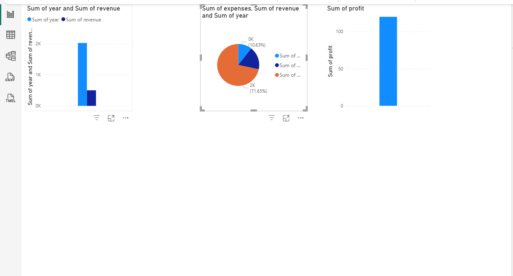

## API Endpoints

- `GET /` → Health check
- `GET /ping` → Server up check
- `GET /data` → Get all financial data
- `GET /data?company=Tesla&year=2023` → Filtered data

## Run the app

```bash
python init_db.py
python -m uvicorn main:app --reload
## 📊 Power BI Dashboard

A snapshot of the Power BI dashboard used in this project:


